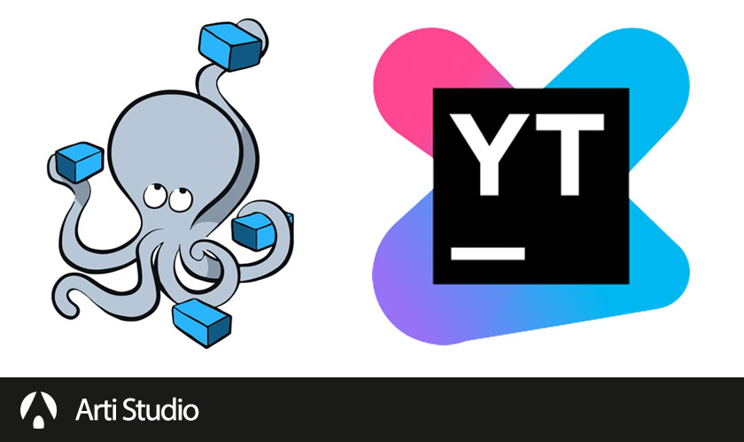

# Youtrack

YouTrack is a project management tool from a company called JetBrains which make IDEs like PHPStorm, PyCharm, GoLand, etc. It offers nice features like issues tracking, sprint plan, workflow, and many more.

## Installation
- Clone this repo
- Rename `.env-sample` to `.env`
- Run with docker-compose `docker-compose up -d`

## References:
* [JetBrains Youtrack](https://www.jetbrains.com/youtrack/)
* [JetBrains Youtrack - Documentation](https://www.jetbrains.com/youtrack/documentation/)